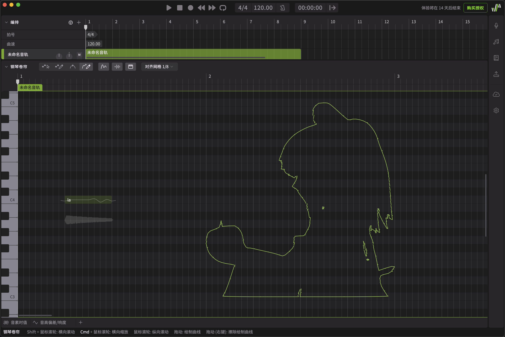

# Synthesizer V R3 (AKA The Synthesizer V Studio 2) SVG-to-Pitch converter



## Dependencies

`matplotlib` if you need to use `claude.py` for visualization

Absolutely needed:

`svg.path numpy`

## Usage

`main.py`:

```
usage: main.py [--width WIDTH] [--height HEIGHT] [-x X] [-y Y] [--precision PRECISION] [--force] [--help] input [output]

Convert SVG files to SVP format.

positional arguments:
  input                 Input SVG file
  output                Output SVP file (default: input file with .svp extension)

options:
  --width WIDTH, -w WIDTH
                        Number of quarter notes wide (default: 4)
  --height HEIGHT, -h HEIGHT
                        Number of semitones tall (default: 12)
  -x X                  Starting X position, in quarter notes (default: 4)
  -y Y                  Starting Y position, in MIDI note IDs (default: 12)
  --precision PRECISION, -p PRECISION
                        Polyline precision (higher values = more points)
  --force, -f           Overwrite output file if it exists
  --help                show this help message and exit
```

`claude.py`:

```
usage: claude.py [-h] [--precision PRECISION] [--output OUTPUT] [--visualize] svg_file

Convert SVG to normalized polylines

positional arguments:
  svg_file              Input SVG file

options:
  -h, --help            show this help message and exit
  --precision PRECISION, -p PRECISION
                        Polyline precision (higher values = more points)
  --output OUTPUT, -o OUTPUT
                        Output file (defaults to stdout)
  --visualize, -v       Visualize the normalized polylines
```

# License

MIT License; see `LICENSE`.
